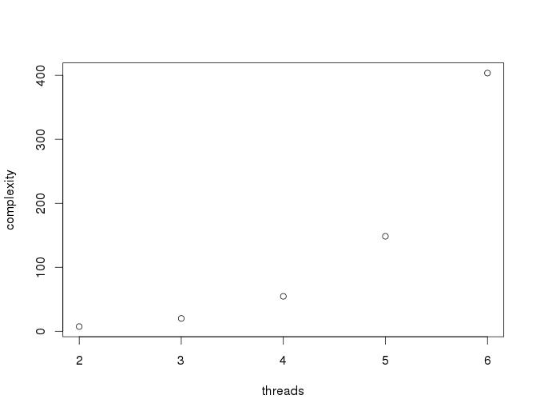

% Python + ZeroMQ
% Miguel Sánchez de León Peque
% 2015-09-17

# Python

## N/A

...

# ØMQ

## ¿Por qué?

> ØMQ mola mucho -
> Si no tienes un proyecto que lo necesite... ¡crea uno!

----

](./figures/clock_freq.png)

## Relatividad

> e = mc^2

>- `e`: energía (esfuerzo).
>- `m`: masa (líneas de código).
>- `c`: ~~velocidad de la luz~~ concurrencia.

----

## Concurrencia

- *Locks*.
- Semáforos.
- Secciones críticas.

. . .

El código **falla**. *Bugs* misteriosos...

Trastornos irreversibles...

## Alternativa

> Modelo de actores.

>- Independientes.
>- Paso de mensajes.
>- `c = 1`

## ØMQ

>- Sin datos compartidos (modelo de actores).
>- Comunicación por paso de mensajes.
>- Comunicación asíncrona.
>- Multiconexión (no necesariamente uno-a-uno).
>- Multipatrón (REQ-REP, PUB-SUB...).
>- Multitransporte (inproc, ipc, tcp, pgm, epgm).
>- Multilenguaje (C, C++, Python, Scala, Haskell, Go...).
>- Multiplataforma.
>- Escalable (hilos, procesos, máquinas).
>- LGPL.

----

# Patrones

## REQ-REP

](./figures/req_rep.png)

## PUB-SUB

](./figures/pub_sub.png)

## PUSH-PULL

](./figures/push_pull.png)

----

, [OpenClipArt](https://openclipart.org/detail/125887/bulle-bubble)](./figures/boring.jpg)

# Fin

## La Guía

Documentación definitiva: [http://zguide.zeromq.org/](http://zguide.zeromq.org/)

## ¿Dudas? ¿Comentarios? ¿Críticas?

## Ejemplos con Python

Para justificar esta presentación...
