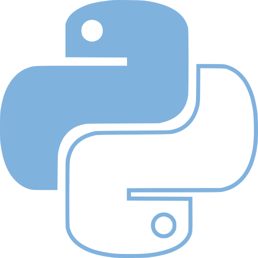

:title: Magic methods for Muggles
:data-transition-duration: 1
:css: psm.css

----

*Magic* methods for Muggles
===========================

**Alex Hermida**
----------------

@alexhermida

http://www.initios.com

----

:id: muggle

Muggle
======

	*"A person who is born to two non-magical parents and is incapable of performing magic"*

----

----

Also known as..
===============

Special
-------

Dunder
------

Double-underscore
-----------------

----

DISCLAIMER
==========

Only.. Python 3
---------------

From scratch
------------

----
	
Tipical method
============== 

.. code:: python

    def __init__(self):

----

.. code:: python

    def __whatever__(self):

----

:id: some-special-methods-1

Some Special methods 1/2
------------------------

- string/bytes representation: __repr__, __str__, __format__, __bytes__
- conversion to number: __abs__, __bool__, __complex__, __int__, __float__, __hash__
- emulating collections: __len__, __getitem__, __setitem__, __delitem__, __contains__
- iteration: __iter__, __reversed__, __next__
- emulating callables: __call__
- context management: __enter__, __exit__

----

:id: some-special-methods-2

Some Special methods 2/2
------------------------

- instance creation and destruction: __new__, __init__, __del__
- attribute management: __getattr__, __getattribute__, __setattr__, __delattr__, __dir__
- attribute descriptors: __get__, __set__, __delete__
- class services: __prepare__, __instancecheck__, __subclasscheck__
- operators: __add__ +, __sub__ -, __mul__ \*, __lt__ >, __le__ <=, __eq__ ==

----

:id: objects-initialization-1

Objects Initialization
----------------------

.. code:: python

		def __init__(self, magic_types, strenth):
			self.magic_types = magic_types
			self.strenth = strenth
	
	>>> wizard = Wizard('transfiguration', 8)
	>>> wizard.magic_types
	'transfiguration'

----

:id: objects-initialization-2

Objects Initialization
----------------------

.. code:: python

	def __new__(cls[, ...]):

	def __del__(self):

----

Representing objects
---------------------

.. code:: python

	def __str__(self):

	def __repr__(self):

	
.. note::
	
	**EXAMPLE 1**

----

Containers
----------

* List and dictionary-style access and modification.
* Membership testing
* Length checking
* Basic looping (implicit iterator)
* Reversal

----

Containers
----------

.. code:: python

	__getitem__(self, index)

	__setitem__(self, index, value) 
	
	__delitem__(self, index) 
	
	__len__(self) 
 	
 	__contains__(self, value)
	
	__reversed__(self)

----

Containers
----------

.. code:: python

	hermione = Wizard('tiger', False)

	magicians = [harry, hermione]

	main_character = magicians[0]
	main_character = magicians.__getitem__(0)

	magicians[1] = ron
	magicians.__setitem__(1, ron)

	del magicians[1]
	magicians.__delitem__(1)

	len(magicians)
	magicians.__len__()

	hermione in magicians
	magicians.__contains__(hermione)

----

Attribute Access
----------------

.. code:: python

	__getattr__(self, name)

	__setattr__(self, name, value) 
	
	__delattr__(self, name)
	
	__getattribute__(self, name)
	
	__dir__(self)

----

Attribute Access
----------------

.. code:: python
	
	def __getattr__(self, name):

.. note::

	**Example 2**

----

Attribute Access
----------------

.. code:: python
	
	def __getattribute__(self, name):

----

:id: attribute-access

Attribute Access
----------------

.. code:: python
	
	class Muggle:
		def __getattr__(self, name):
			return 'I don´t have attr %s!' % name

		def __getattribute__(self, name):
			print('My attr: ', name)
			return self.tech

.. note::

	**Example-3**
		
----

Magic example
=============

.. code:: python
	
	class PoweredWizard:

.. note::
		
	**Example-4**

----

Getting info about methods
---------------------------

.. code:: python
	
	object.__dir__(self)

.. note::
	
	**Example-5**

----

Getting info about methods
==========================

	* Attribute management
	* Proxy methods
	* Operators overloading
	* Others..

----

The Zen of Python
=================

- Explicit is better than implicit.

- In the face of ambiguity, refuse the temptation to guess.

----

:id: resources-links

Resources:
==========

* https://docs.python.org/3/reference/datamodel.html#special-method-names
* http://www.rafekettler.com/magicmethods.html
* http://www.diveintopython3.net/special-method-names.html
* https://bitbucket.org/cliff/special_methods/
* **http://harrypotter.wikia.com/**

----

Thanks!
=======

@alexhermida

