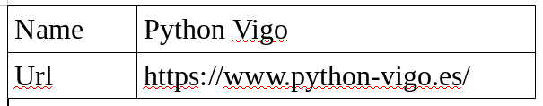

% Python object serialization: PICKLE
% Clara Casas
% 2016-12-15

---

I want to save or share a data structure.

{width=70%}

# Some ideas

## Formats

How to organize or encode the information?

* Delimiter-separated format
```
Name,Python Vigo
Url,https://www.python-vigo.es/
```

---

* JSON
```
{
  "Name": "Python Vigo",
  "Url": "https://www.python-vigo.es/"
}
```
* *Pickle* protocol
```
{
b'\x80\x03}q\x00(X\x03\x00\x00\x00Urlq\x01X\x1b
\x00\x00\x00https://www.python-vigo.es/q\
x02X\x04\x00\x00\x00Nameq\x03X\x0b\x00\x00
\x00Python Vigoq\x04u.'
}
```

## Serialization?

> **Process of translating** data structures into a format that can be stored and reconstructed later in the same or another computer environment.

# Pickle Module

## Characteristics

* Binary serialization format
* Not human-readable
* Python specific
* Represent a large number of python types
* Compact representation
* Fast

## Serializing or Pickling
```python
import pickle
obj = {'Name': 'Python Vigo', 'Url':'https://www.python-vigo.es/'}
# Return the pickled representation on a bytes object
obj_ser = pickle.dumps(obj)
# Write the pickled representation on a file
with open('data.pickle','wb') as f:
    pickle.dump(obj, f)
```
>pickle.dump(obj, file, protocol=None, * , fix_imports=True)

## De-serializing or Unpickling
```python
import pickle
# Return the pickled representation on a bytes object
obj_unser = pickle.loads(obj_ser)
# Read the pickled representation from a file
with open('data.pickle','rb') as f:
    obj_unser = pickle.load(f)
```
>pickle.load(file, * , fix_imports=True, encoding="ASCII", errors="strict")

## Warnings

* Restrictions in the unpickling environment.
* Insecure

# Thank you! :D
