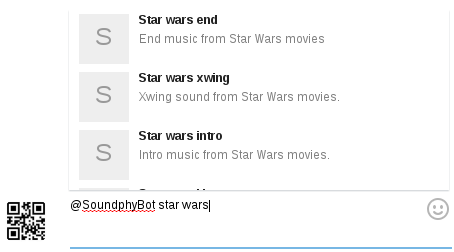
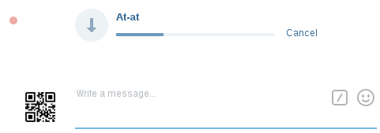
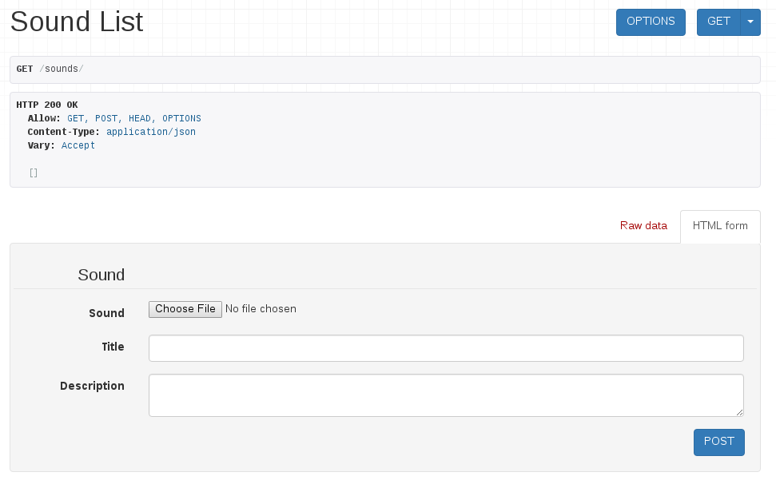
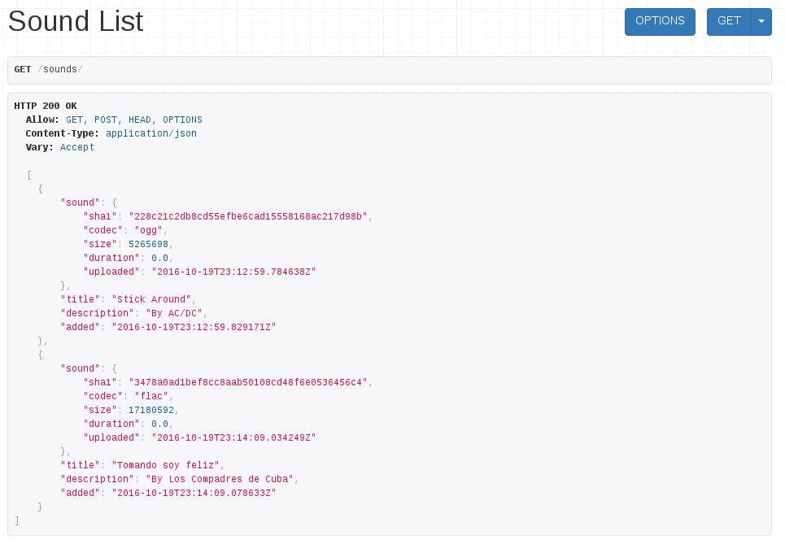

% Soundphy
% Miguel Sánchez de León Peque
% 2017-02-16

# History

---

{width=48%}

## Ideas

> Best bots are inline bots, those which you can share with others in a conversation!

>- ~~~Gifs bot~~~
>- ~~~Videos bot~~~
>- **Instants bot**

## Problem

>- Gifs bot → giphy.com
>- Videos bot → youtube.com
>- **Instants bot → ???**

# Soundphy

## Technologies

>- Python
>- Spiders: `requests`, `bs4`
>- Search engine: `whoosh`
>- Web services: `flask`
>- Bot: `python-telegram-bot`
>- Deployment: OpenShift Online

## It works!

{width=70%}

## But...

{width=70%}

# Soundphy (II)

## Idea

- Sound database
- Collaborative
- User access control
- Machine-friendly access
- Human-friendly access

## Technologies

- Python
- `django`
- `django-rest-framework`
- ...

## Free

- [https://github.com/Soundphy](https://github.com/Soundphy)
- BSD license (3-clause)

{width=15%}

---

{width=60%}

## Starting point

- [https://github.com/Soundphy/soundphy](https://github.com/Soundphy/soundphy)
- Basic REST API
- Upload and store files
- Simple models
- Simple interface
- CI infraestructure
- ...

---

{width=100%}

---

{width=100%}

# Tasks

## Idea(lly)

- Independent/parallel
- All levels
- All interests/backgrounds

## First steps

- Installing Python 3
- Installing an editor
- Working with Git and GitHub

## Users

- User registration
- Access control in the REST API
- (Tests)

## Models

- Extend/improve the current models
- Keep history (avoid DELETE)
- (Tests)

## Sounds

- Calculate the duration of sounds
- Infer other useful parameters
- (Tests)

## Database

- Integrate a search engine
- (Tests)

## Deployment

- OpenShift Online
- (Documentation)

## Other?

# Let the fun begin!

## Thank you!

- Questions?
- Comments?
- Suggestions?

## Possible groups

- First steps
- Users
- Models
- Sounds
- Database
- Deployment
