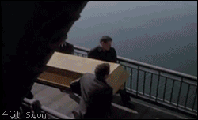
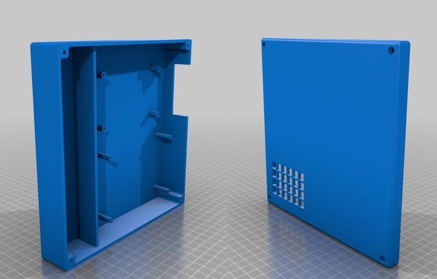

% Python para MacGyvers
% Clara Casas Castedo & Miguel Sánchez de León Peque
% PyDay Galicia | 2017-06-10

¿Por qué MacGyver?
==================

---


---

{width=80%}

---

{width=80%}

---

{width=80%}


¿Por qué Python?
================

---

- **Sintaxis** - Elegante, sangrado, PEPs
- **Potencia** - Interpretado, rápido (no es broma), flexible
- **Comunidad** - PyPI, StackOverflow
- **Ubicuidad** - Web, ciencia, escritorio...

---



---

```python
# Enclosure dimensions
WIDTH = 180
LENGTH = 180
BOTTOM_HEIGHT = 30
TOP_HEIGHT = 10
THICK = 3

# Passthrough holes
PASS_INNER = 3
PASS_OUTTER = 8
PASS_CBORE = 6
PASS_CBORE_DEPTH = THICK / 2.
PASS_WIDTH = WIDTH - PASS_OUTTER
PASS_LENGTH = LENGTH - PASS_OUTTER

# Mesh dimensions
MESH_SPACE = 10
MESH_WIDTH = 6
MESH_LENGTH = 4

# CKIT dimensions
CKIT = dict(
    WIDTH=99,
    LENGTH=63,
    CLEAR=15,
    INNER=2,
    OUTTER=5,
    HEIGHT=20
)
CKIT['CENTER_WIDTH'] = (WIDTH - CKIT['WIDTH']) / 2. - CKIT['CLEAR']
CKIT['CENTER_LENGTH'] = (LENGTH - CKIT['LENGTH']) / 2. - CKIT['CLEAR']

# Raspberry Pi dimensions
RBPI_HOLE_WIDTH = 56
RBPI_HOLE_HEIGHT = 20
RBPI = dict(
    WIDTH=85,
    LENGTH=49,
    CLEAR=27,
    INNER=2.75,
    OUTTER=6,
    HEIGHT=BOTTOM_HEIGHT-RBPI_HOLE_HEIGHT
)
RBPI['CENTER_WIDTH'] = (WIDTH - RBPI['WIDTH']) / 2. - RBPI['CLEAR']
RBPI['CENTER_LENGTH'] = -((LENGTH - RBPI['LENGTH']) / 2. - RBPI['CLEAR'])

# Wall dimensions
WALL_THICK = THICK
WALL_CENTER_WIDTH = min(
    RBPI['CENTER_WIDTH'] - RBPI['WIDTH'] / 2. - RBPI['CLEAR'],
    CKIT['CENTER_WIDTH'] - CKIT['WIDTH'] / 2. - CKIT['CLEAR']
)
WALL_HEIGHT = BOTTOM_HEIGHT - 5


def enclosure_passthrough_vertices(face):
    workplane = face.workplane()
    rect = workplane.rect(PASS_WIDTH, PASS_LENGTH, forConstruction=True)
    return rect.vertices()


def enclosure(height):
    # Bottom enclosure part
    part = Workplane('XY').box(WIDTH, LENGTH, height)\
        .faces('+Z').shell(THICK)
    part = enclosure_passthrough_vertices(part.faces('>Z'))\
        .rect(PASS_OUTTER, PASS_OUTTER).extrude(-height)\
        .edges('|Z').fillet(2)
    part = enclosure_passthrough_vertices(part.faces('<Z'))\
        .cboreHole(PASS_INNER, PASS_CBORE, PASS_CBORE_DEPTH)
    return part


def mount_vertices(face, dimm):
    return face.workplane()\
        .center(dimm['CENTER_WIDTH'], dimm['CENTER_LENGTH'])\
        .rect(dimm['WIDTH'], dimm['LENGTH'], forConstruction=True).vertices()


def mount(part, dimm):
    vertices = mount_vertices(part.faces('<Z'), dimm)
    part = vertices\
        .circle(dimm['OUTTER'] / 2.).extrude(-THICK - dimm['HEIGHT'])
    part = vertices\
        .cboreHole(dimm['INNER'], dimm['OUTTER'], PASS_CBORE_DEPTH)
    return part


# Bottom enclosure
bottom = enclosure(BOTTOM_HEIGHT)

# CKIT and Raspberry Pi mounts
bottom = mount(bottom, CKIT)
bottom = mount(bottom, RBPI)

# Raspberry Pi hole
bottom = bottom.faces('>X').workplane()\
    .center(-RBPI['CENTER_LENGTH'], (BOTTOM_HEIGHT - RBPI_HOLE_HEIGHT) / 2.)\
    .rect(RBPI_HOLE_WIDTH, RBPI_HOLE_HEIGHT).cutBlind(-THICK)

# Wall
bottom = bottom.faces('<Z').workplane()\
    .center(WALL_CENTER_WIDTH, 0)\
    .rect(WALL_THICK, LENGTH)\
    .extrude(-WALL_HEIGHT - THICK)


# Top enclosure
top = enclosure(TOP_HEIGHT)
top = top.mirror('XY')

# CKIT mesh
top = top.faces('<Z').workplane()\
    .center(CKIT['CENTER_WIDTH'], CKIT['CENTER_LENGTH'])\
    .rarray(MESH_SPACE, MESH_SPACE, MESH_WIDTH, MESH_LENGTH, center=False)\
    .rect(8, 8).cutThruAll()

top = top.translate((WIDTH + 20, 0, 0))
```


Retos
=====

## ¡Ponte a prueba!

- Exercism: [exercism.io](http://exercism.io/)
- Tuenti Challenge: [contest.tuenti.net](https://contest.tuenti.net/)
- Project Euler: [projecteuler.net](https://projecteuler.net/)
- Rosalind: [rosalind.info](http://rosalind.info/)

## ¿Preguntas?
