% La serpiente y el cerdito :snake: :pig:
% Clara Casas Castedo & Miguel Sánchez de León Peque
% 2019-01-17

El cerdito :pig:
================

Coink
-----

<video src="./videos/coink.mp4" controls muted>
</video>

-------

{width=100%}

[https://www.hackster.io](https://www.hackster.io)


Necesitaremos ...
-----------------

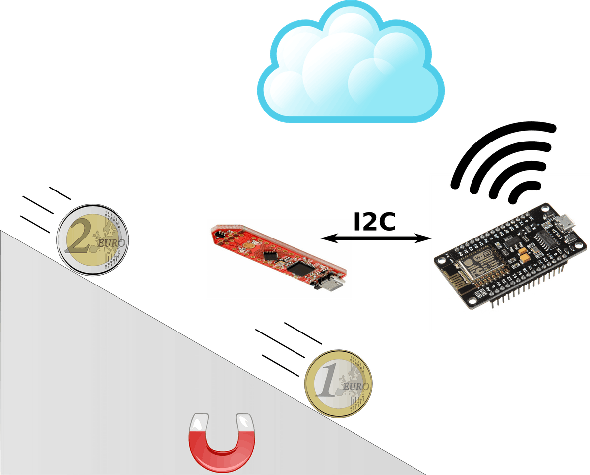{width=70%}

---

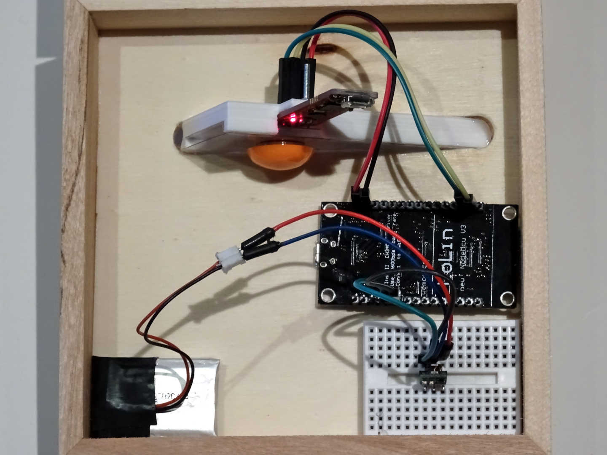{width=80%}


La serpiente :snake:
====================

Micropython
-----------

{width=40%}


NodeMCU
-------

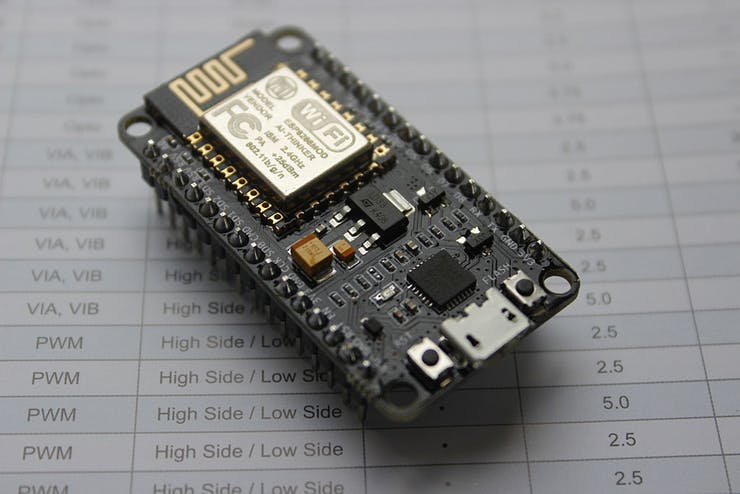

---


I2C
---

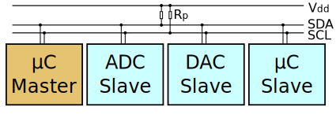{width=100%}

Cableado
--------

NodeMCU pin |	Magnetic sensor pin
--- | ---
D1 (GPIO5) |	SDA (P2.10)
D2 (GPIO4) |	SCL (P2.11)
3V3 |	3V3 (P1.0)
GND |	GND

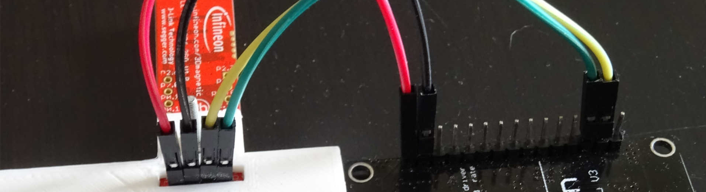{width=80%}

Código
------

```python
from machine import I2C
from machine import Pin


i2c = I2C(scl=Pin(5), sda=Pin(4), freq=400000)
devices = i2c.scan()

address = devices[0]
i2c.writeto(address, b'123')          # Write 3 bytes
i2c.readfrom(address, 4)              # Read 4 bytes
i2c.readfrom_mem(address, 8, 3)       # Read 3 bytes at address 8
i2c.writeto_mem(address, 2, b'\x10')  # Write 1 byte at address 2
```

Hojas de especificaciones
-------------------------

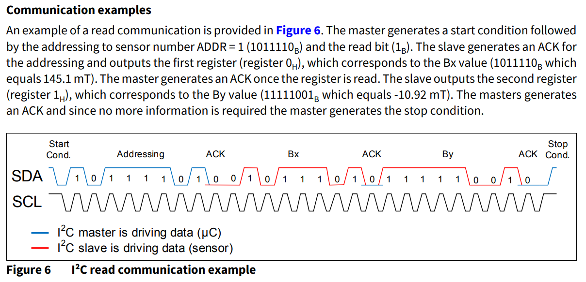{width=100%}

Código final
------------

```python
def read_registers(i2c):

    read_address = 0x6b
    trigger = 1 << 7
    request = bytearray([read_address, trigger])
    reply = bytearray(7)

    i2c.start()
    ack = i2c.write(request)
    i2c.readinto(reply)
    i2c.stop()

    return reply, ack
```

WiFi y HTTP :heart_eyes:
-------------------------

```python
station = WLAN(STA_IF)
station.active(True)
station.connect(config['ssid'], config['password'])
```

```python
reply = urequests.get(url)
reply = urequests.post(url, data=bytearray(ring))
```

Captura de datos del sensor
---------------------------

- tiempo total 1 segundo de datos
- 1000 lecturas por segundo
- sensor 3D con dimensiones x, y, z y tiempo

Manejo eficiente de memoria -> buffers + 'array'
------------------------------------------------

```python

x_array = array.array('h', (0 for i in range(num_measures)))
```
[https://docs.micropython.org/array](https://docs.micropython.org/en/latest/library/array.html#module-array)


Memoria vs tiempo de ejecución
------------------------------

```python
def read_coin(self):
        '''
        Read magnetic sensor values and save on RAM (arrays)
        '''
def save_readings(self):
        '''
        Save magnetic sensor values from RAM to a file
        '''
```

Buffer circular, la solución definitiva
---------------------------------------

```python
ring = array.array('h', (0 for i in range(4 * num_measures)))

def loop(self):
        ....
        position = i * 4
        ring[position] = time.ticks_us() % 65536
        ring[position + 1] = x
        ring[position + 2] = y
        ring[position + 3] = z
        .....
        urequests.post(url, data=bytearray(ring))

```

Analizando monedas
------------------

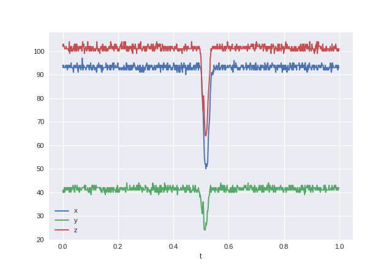{width=80%}

Características
---------------

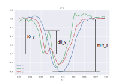{width=80%}

Diferenciación (min)
--------------------

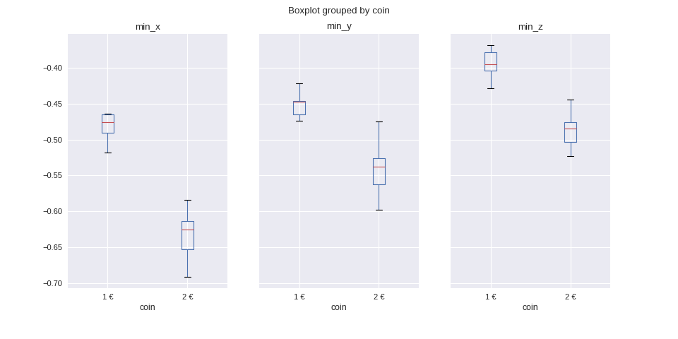

Diferenciación (d0)
-------------------

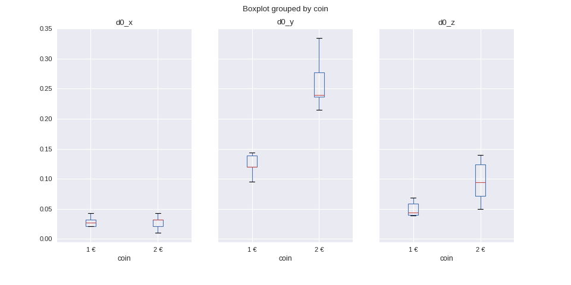

Diferenciación (l0)
-------------------

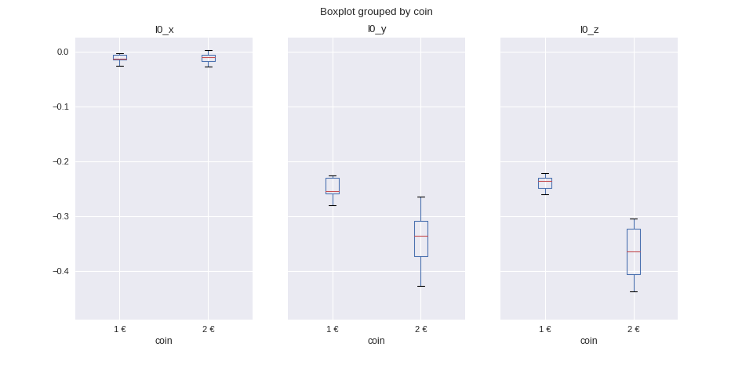

La nube con Flask :cloud:
-------------------------

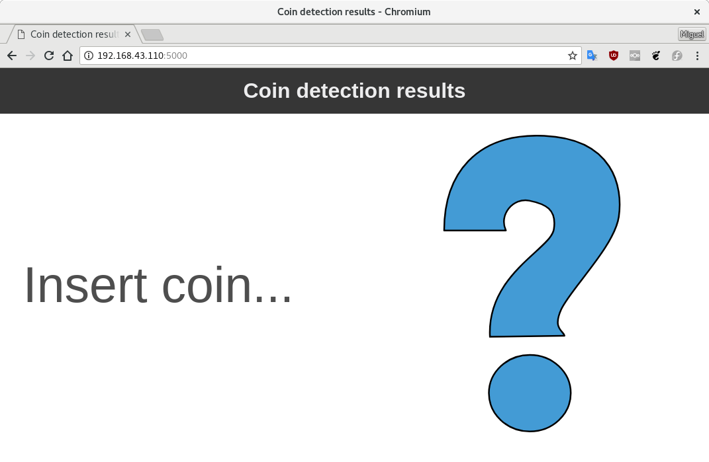{width=80%}

ThingSpeak
----------

```matlab
[data, time] = thingSpeakRead(516536, 'Fields', [1], 'NumDays', 7);
data = timetable(time, data)
data = retime(data, 'daily', 'sum')
bar(data.time, data.Variables, 'FaceColor', [1 .5 0])
```

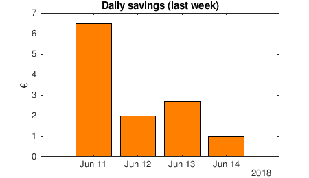


¡Eso es todo! :tada:
=============

Fuentes
-------

- Código: [github.com/CojoCompany/coink](https://github.com/CojoCompany/coink/)
- Documentación:
[coink.readthedocs.io](https://coink.readthedocs.io/)
- Presentación: [cojocompany.github.io/PythonVigo-2019-Coink/](https://cojocompany.github.io/PythonVigo-2019-Coink/)

¿Preguntas? :blush:
-----------
