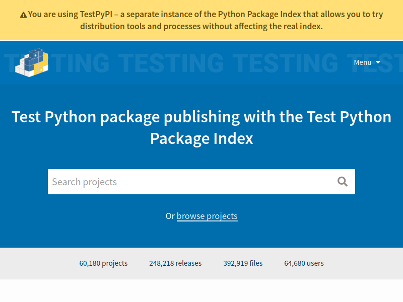
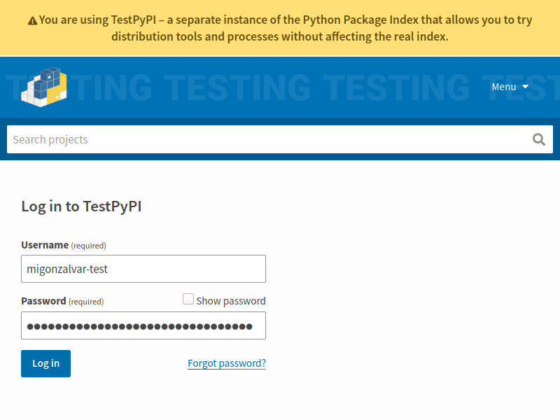
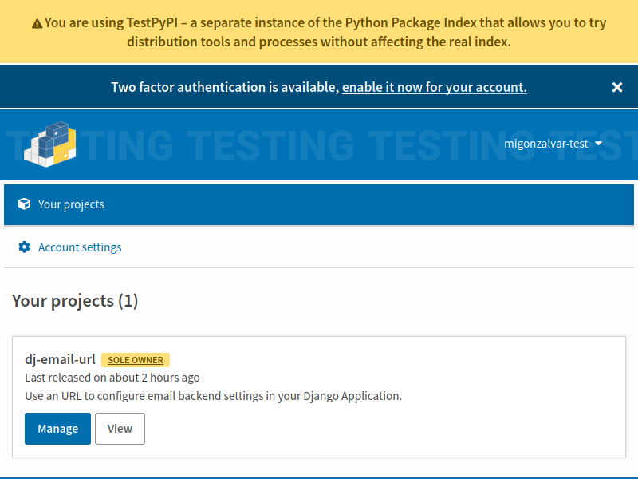
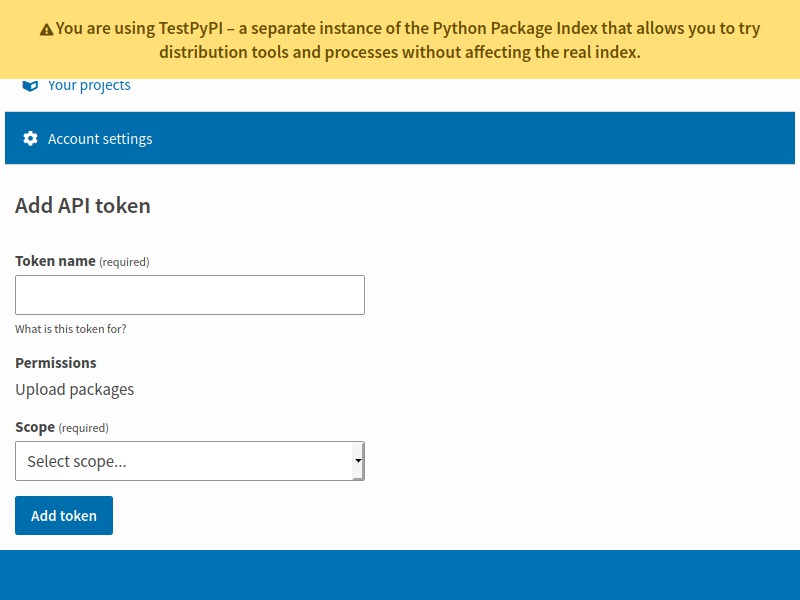

---
title: Distribuir paquetes con Python
author: Miguel González
date: Febrero 2020
...

------

# Empezamos

## Ejemplo

- Partimos de un script [main.py](01-script/main.py)

# Paquete básico

## Preparación para empaquetar

- Disposición del código: eliminamos efectos secundarios en el `import`.

- Renombrar para que sea importable (módulo).

- Resultado módulo [chove.py](02-modulo/chove.py)

## Empaquetar

- Añadir:

  - [setup.py](03-setup/setup.py)
  - [README.rst](03-setup/README.rst)

- Creamos el paquete fuente.

------

```console
$ python3 setup.py sdist
running sdist
running egg_info
writing chove.egg-info/PKG-INFO
writing dependency_links to chove.egg-info/dependency_links.txt
writing top-level names to chove.egg-info/top_level.txt
reading manifest file 'chove.egg-info/SOURCES.txt'
writing manifest file 'chove.egg-info/SOURCES.txt'
running check
creating chove-0.0.1
creating chove-0.0.1/chove.egg-info
copying files to chove-0.0.1...
copying README -> chove-0.0.1
copying chove.py -> chove-0.0.1
copying setup.py -> chove-0.0.1
copying chove.egg-info/PKG-INFO -> chove-0.0.1/chove.egg-info
copying chove.egg-info/SOURCES.txt -> chove-0.0.1/chove.egg-info
copying chove.egg-info/dependency_links.txt -> chove-0.0.1/chove.egg-info
copying chove.egg-info/top_level.txt -> chove-0.0.1/chove.egg-info
Writing chove-0.0.1/setup.cfg
Creating tar archive
removing 'chove-0.0.1' (and everything under it)
```

------

- En la carpeta [./dist/](03-setup/dist/) está el paquete

# Python Package Index

## Alta en PyPI

- Registrar cuenta en PyPI.

  Existe un entorno de [test](https://test.pypi.org/).

------



------



------



------



## twine

------

```console
$ twine upload --repository-url https://test.pypi.org/legacy/ dist/*
twine upload --repository-url https://test.pypi.org/legacy/ dist/*
Uploading distributions to https://test.pypi.org/legacy/
Enter your username: migonzalvar-test
Enter your password:
Uploading chove-0.0.1.tar.gz
100%|███████████████████████████████| 4.34k/4.34k [00:01<00:00, 2.37kB/s]

View at:
https://test.pypi.org/project/chove/0.0.1/
```

## Probar, probar, probar

```console
$ podman run -it python:3.6 bash
root@8dae05ae553a:/# pip install -i https://test.pypi.org/simple/ chove==0.0.1
Looking in indexes: https://test.pypi.org/simple/
Collecting chove==0.0.1
Downloading https://test-files.pythonhosted.org/packages/ad/27/a32f56222c1131df2a88555079d4bce66e0576c277231721d2eb139fa556/chove-0.0.1.tar.gz (1.4 kB)
Building wheels for collected packages: chove
Building wheel for chove (setup.py) ... done
Created wheel for chove: filename=chove-0.0.1-py3-none-any.whl size=1803 sha256=a8391babc09ee817bcc2c11741fbe1c3bc15bf42c9cbf49cb388ea9c487d4b35
Stored in directory: /root/.cache/pip/wheels/b3/b0/fe/ad7a1e70a9ed95f928a2fcba2226c9605b136731b66fa487e7
Successfully built chove
Installing collected packages: chove
Successfully installed chove-0.0.1
root@8dae05ae553a:/# python
Python 3.6.10 (default, Feb  2 2020, 09:39:59)
[GCC 8.3.0] on linux
Type "help", "copyright", "credits" or "license" for more information.
>>> import chove
>>> chove.main()
La predicción para 16/02/2020 es:

Mañana 60%
Tarde 80%
Noche 80%
>>>
```

------

¿Y cómo se ejecuta?

------

```console
$ podman run -it python:3.6 bash
root@ac72144ab837:/# pip install -i https://test.pypi.org/simple/ chove==0.0.1
Looking in indexes: https://test.pypi.org/simple/
Collecting chove==0.0.1
  Downloading https://test-files.pythonhosted.org/packages/9e/f8/bc40d2d2eeea0e42877b38f8918e21d2fc3b69fb8ce885fc95e0fa5f4cf7/chove-0.0.1-py3-none-any.whl (1.8 kB)
Installing collected packages: chove
Successfully installed chove-0.0.1
root@ac72144ab837:/# python -m chove
La predicción para 20/02/2020 es:

Mañana 20%
Tarde 10%
Noche 5%
root@ac72144ab837:/# exit
```

## Versiones

- Nunca se sobreescribe un archivo.

## Creación automática de scripts

- Se trata de poner:

  ```python
  entry_points={
        "console_scripts": [ ....
  ```

- Resultado: [setup.py](05-entry_points/setup.py)

# Continuará...

## Más

- README con formato, registro de cambios, documentación...
- Paquetes
- Dependencias de instalación y de test
- Dependencias extra
- _wheel_
- Compilación
- ...

## Referencias

- PyPI de pruebas https://test.pypi.org/

- Twine https://pypi.org/project/twine/

- Tutorial https://packaging.python.org/tutorials/packaging-projects/

- Proyectos de ejemplo: https://github.com/pypa/sampleproject
  o https://github.com/ionelmc/python-nameless

- `src` o no `src` https://hynek.me/articles/testing-packaging/ y
  https://blog.ionelmc.ro/2014/05/25/python-packaging/

- Plantillas de cookiecutter:
  https://github.com/ionelmc/cookiecutter-pylibrary/ (`src`)
  y https://github.com/audreyr/cookiecutter-pypackage (no `src`)

# Gracias
